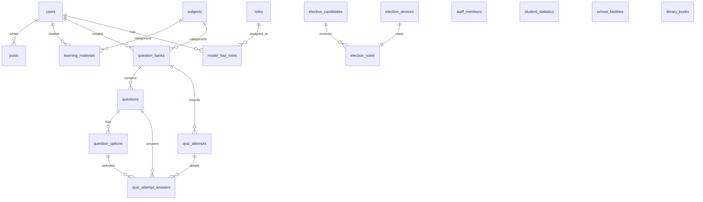

# Software Architecture Document (SAD)
## SMP Negeri 4 Cepu — "Satu Sekolah, Satu Ruang Digital" (Tahap V1)

---

## 1. Ikhtisar Arsitektur Sistem

Arsitektur aplikasi dibangun dengan paradigma **Modular Monolith** memanfaatkan ekosistem **TALL Stack (Tailwind CSS, Alpine.js, Laravel 11/12, Livewire v3)** dan **Filament PHP v3**. Pendekatan ini dipilih berdasarkan evaluasi mendalam atas batasan pengerjaan 4 minggu dan lingkungan hosting terkelola **Hostinger Cloud Startup** (LiteSpeed Web Server Enterprise, PHP 8.2+, MariaDB, 4 vCPU, 4GB RAM, tanpa daemon proses root/WebSocket persisten).

```text
+-----------------------------------------------------------------------------------+
|                                  CLIENT LAYER                                     |
|   Desktop Browser / Mobile Phone / Tablet (Light & Dark Mode - Alpine.js + CSS)   |
+-----------------------------------------+-----------------------------------------+
                                          | HTTPS (TLS 1.3)
                                          v
+-----------------------------------------------------------------------------------+
|                         WEB SERVER LAYER (HOSTINGER CLOUD)                        |
|   LiteSpeed Web Server Enterprise (LSWS)                                          |
|   - Event-Driven Architecture (100 Concurrent PHP Workers)                        |
|   - LiteSpeed Cache (LSCache) & Static Asset Compression (Gzip/Brotli)            |
|   - .htaccess Rules (Cache Bypass for /admin and /livewire)                       |
+-----------------------------------------+-----------------------------------------+
                                          | LSPHP (LiteSpeed SAPI) + Zend OPcache
                                          v
+-----------------------------------------------------------------------------------+
|                        APPLICATION LAYER (LARAVEL 11/12)                          |
|                                                                                   |
|  [ Presentation Domain ]                                                          |
|  ├── Blade Views + Tailwind v3 : Portal Profil Publik, Informasi, Berita, Galeri |
|  ├── Livewire v3 Components    : Filter GTK, Bilik Pilketos, Quick Count Polling  |
|  └── Filament PHP v3 Admin     : Back-Office CMS (Posts, GTK, Perpus, Soal, Paslon)|
|                                                                                   |
|  [ Security & Authorization ]                                                     |
|  ├── Filament Shield           : RBAC (super_admin, guru, staf_perpus, pilketos)  |
|  └── Session & Cookie Auth     : Database Session Driver + HttpOnly Strict Cookie |
|                                                                                   |
|  [ Core Business Services ]                                                       |
|  ├── PilketosFingerprintService: Multi-layer Device Identity, Subnet /24, Voting   |
|  └── QuizAssessmentService     : Zero Client Leakage, Server Evaluation, Scoring |
|                                                                                   |
|  [ Domain Model Layer (Eloquent ORM) ]                                            |
|  ├── User, Post, StaffMember, StudentStatistic, SchoolFacility                    |
|  ├── LibraryBook, Subject, LearningMaterial, QuestionBank, Question               |
|  └── QuizAttempt, QuizAttemptAnswer, ElectionCandidate, ElectionDevice, Vote     |
+-----------------------------------------+-----------------------------------------+
                                          | PDO MySQL Connection
                                          v
+-----------------------------------------------------------------------------------+
|                         DATABASE LAYER (MARIADB 10.11+)                           |
|   - 16 Relational Tables Normalized to 3NF                                        |
|   - Strict Foreign Key Cascades & Composite B-Tree Indexes                        |
|   - Isolated Anonymous Ballot Box & Device Audit Tables                           |
+-----------------------------------------------------------------------------------+
```

---

## 2. Struktur Modul & Penataan Direktori

Sistem mengadopsi struktur monolitik modular untuk memisahkan domain logika bisnis tanpa fragmentasi repositori:

```text
laravel_app/
├── app/
│   ├── Enums/                              # Strict Types & Value Objects PHP 8.2+
│   │   ├── EmploymentStatus.php            # PNS, PPPK, Honorer
│   │   ├── GradeLevel.php                  # Kelas 7, 8, 9
│   │   └── PostCategory.php                # Berita, Pengumuman, Agenda
│   ├── Filament/                           # Panel Admin & Guru Terpadu
│   │   ├── Resources/
│   │   │   ├── ElectionCandidates/         # Manajemen Paslon Pilketos
│   │   │   ├── LearningMaterials/          # Modul Materi Belajar
│   │   │   ├── LibraryBooks/               # Katalog Buku Perpustakaan
│   │   │   ├── Posts/                      # Berita, Pengumuman, Agenda
│   │   │   ├── QuestionBanks/              # Bank Soal & Butir Pertanyaan
│   │   │   ├── SchoolFacilities/           # Fasilitas Sekolah
│   │   │   ├── StaffMembers/               # Guru & Tendik
│   │   │   ├── StudentStatistics/          # Rekap Rombel & Statistik Siswa
│   │   │   └── Subjects/                   # Master Mata Pelajaran SMP
│   │   └── Widgets/
│   │       ├── PilketosLiveChartWidget.php # Realtime Chart Polling (wire:poll.5s)
│   │       └── SchoolOverviewWidget.php    # Ringkasan Metrik Sekolah
│   ├── Livewire/                           # Komponen Interaktif Publik
│   │   ├── Pilketos/
│   │   │   ├── LiveCount.php               # Polling Grafik Quick Count Terbuka
│   │   │   └── VotingBooth.php             # Bilik Suara Digital
│   │   └── Quiz/
│   │       └── QuizRoom.php                # Ruang Latihan Soal Interaktif
│   ├── Models/                             # 15 Model Eloquent Lengkap Relasi
│   ├── Policies/                           # 10 File Policy Otorisasi Filament Shield
│   └── Services/                           # Core Business Services
│       ├── PilketosFingerprintService.php  # Validasi Keamanan Multi-Tier Pilketos
│       └── QuizAssessmentService.php       # Zero-Leakage & Penilaian Bank Soal
├── database/
│   ├── migrations/                         # 8 Migrasi Inti 3NF + Spatie Tables
│   └── seeders/                            # Seeder Akun, Master Mapel, & Data Demo
├── public/                                 # Symlinked ke public_html
│   ├── build/                              # Aset Vite Terkompilasi (CSS & JS)
│   └── .htaccess                           # Aturan Routing & LiteSpeed Cache Bypass
└── tests/
    └── Feature/
        ├── AdminPanelTest.php              # Pengujian Akses Dashboard Filament
        └── CoreServicesTest.php            # Unit/Feature Testing Services & RBAC
```

---

## 3. Skema Basis Data Relasional (3NF & Relational Integrity)

### 3.1 Diagram Relasi Entitas (ERD)



### 3.2 Kamus Entitas Relasional

1. **`users`**: Akun login staf internal (Super Admin, Guru, Tenaga Perpustakaan, Panitia). Kolom khusus: `nip` (indexed) dan `dapodik_id` (persiapan V4).
2. **`roles` & `permissions`**: Skema Spatie Permission untuk kontrol otorisasi RBAC granular.
3. **`posts`**: Publikasi warta sekolah dengan kategori ENUM (`berita`, `pengumuman`, `agenda`), `slug` unik terindeks, `event_date`, dan soft deletes.
4. **`staff_members`**: Direktori Pendidik dan Tenaga Kependidikan dengan indeks komposit `(position, employment_status)` untuk mendukung filter cepat Livewire.
5. **`student_statistics`**: Agregat siswa per rombel per tahun ajaran dengan batasan unik komposit `['academic_year', 'class_name']`.
6. **`school_facilities`**: Direktori fasilitas fisik sekolah dengan atribut `display_order`.
7. **`library_books`**: Katalog sirkulasi perpustakaan dengan indeks pencarian pada `title`, `author`, `category`, serta integritas `available_stock`.
8. **`subjects`**: Master 11 mata pelajaran kurikulum merdeka tingkat SMP.
9. **`learning_materials`**: Bahan ajar terstruktur per jenjang kelas (7, 8, 9) dan mata pelajaran.
10. **`question_banks`**: Paket bank soal latihan mandiri dengan durasi pengerjaan dan ambang batas kelulusan (`passing_grade`).
11. **`questions` & `question_options`**: Butir pertanyaan pilihan ganda dengan opsi jawaban. Berelasi cascading delete terhadap bank soal.
12. **`quiz_attempts` & `quiz_attempt_answers`**: Rekaman sesi latihan mandiri siswa dengan pembobotan nilai otomatis dan waktu pengerjaan.
13. **`election_candidates`**: Data pasangan calon ketua/wakil ketua OSIS dengan counter cache `total_votes_cached`.
14. **`election_devices`**: Log sidik jari perangkat pemilih dengan indeks unik `device_fingerprint`.
15. **`election_votes`**: Kotak suara digital yang dipisahkan secara anonim dari data voter untuk menjamin asas rahasia pemilu.

---

## 4. Rekayasa Keamanan & Layanan Inti (Core Services)

### 4.1 Pilketos Multi-Layer Identity Engine (`PilketosFingerprintService`)

Tantangan utama Pilketos Tahap V1 adalah menegakkan prinsip **"1 Suara per Perangkat"** secara terbuka tanpa membebani siswa dengan registrasi akun terpisah, sekaligus mencegah kecurangan manipulasi peramban (*incognito mode*, pembersihan kuki, multi-tab).

```text
[ Browser Klien ]
  │
  ├── 1. Ekstraksi Entropi Hardware (Canvas, WebGL, AudioContext, Screen Res, OS Platform)
  └── 2. Kirim Payload ke Endpoint HTTPS
            │
            v
[ Server-Side Engine: PilketosFingerprintService ]
  │
  ├── Layer 1: Evaluasi Cookie Kriptografis (HttpOnly + SameSite=Strict)
  │            -> Jika cookie 'pilketos_voter_token' ada: REJECT (Sudah Pernah Memilih).
  │
  ├── Layer 2: Sintesis Sidik Jari Server (Composite Hash SHA-256)
  │            -> Hash = SHA256(CookieToken | ClientHardwareHash | IPSubnet/24 | UserAgentHash)
  │
  ├── Layer 3: Pengecekan Basis Data (election_devices)
  │            -> Jika device_fingerprint cocok di database: REJECT (Perangkat Terindikasi Duplikat).
  │
  ├── Layer 4: Penanganan Jaringan NAT Bersama (/24 Subnet Normalization)
  │            -> Masking IP ke /24 (IPv4) atau /64 (IPv6). Ratusan siswa dalam satu Wi-Fi
  │               sekolah tidak akan saling tolak karena hardware hash mereka unik.
  │
  └── Sukses: Eksekusi Transaksi Atomik (DB::transaction)
              ├── Rekam perangkat ke `election_devices`
              ├── Simpan suara anonim ke `election_votes`
              ├── Increment atomik `total_votes_cached` pada `election_candidates`
              └── Terbitkan cookie HttpOnly permanen (365 hari) ke peramban.
```

### 4.2 Mesin Evaluasi Kuis Tanpa Kebocoran Klien (`QuizAssessmentService`)

Untuk menjamin latihan mandiri berintegritas tinggi, sistem menerapkan prinsip **Zero Client Leakage**:

1. **Proyeksi Kueri Aman**: Saat kuis dimuat, Eloquent hanya memproyeksikan `['id', 'question_id', 'option_text']` dari relasi opsi jawaban. Kolom `is_correct` dan `explanation` dipangkas di server sehingga tidak ada metadata kunci jawaban yang mengalir ke tab Network atau Console peramban siswa.
2. **Server-Side Scoring**: Lembar jawaban dikirim berupa pasangan ID `[question_id => selected_option_id]`. Server melakukan pencocokan langsung terhadap basis data, menghitung skor terbobot berbasis skala 100, menentukan kelulusan berdasarkan `passing_grade`, dan menyimpan ke `quiz_attempts`.
3. **Pembahasan Reflektif Pasca-Ujian**: Setelah lembar ujian tersimpan, server menyusun respons umpan balik yang memuat skor akhir, butir salah/benar, dan teks pembahasan (`explanation`) sebagai materi evaluasi belajar.

---

## 5. Arsitektur Infrastruktur & Deployment Hostinger Cloud

### 5.1 Isolasi Direktori (Security Boundary)

Untuk mencegah berkas lingkungan (`.env`), file migrasi, vendor PHP, dan log terekspos ke publik akibat miskonfigurasi web server, struktur direktori dipisahkan secara fisik:

```text
/home/uXXXXX/domains/smpn4cepu.sch.id/
├── laravel_app/                     # Direktori Privat (Root Aplikasi Laravel)
│   ├── app/
│   ├── config/
│   ├── storage/
│   ├── .env                         # Terisolasi penuh dari web root
│   └── ...
└── public_html/ -> laravel_app/public # Symlink murni ke public folder
```

### 5.2 Strategi Caching & Integrasi LiteSpeed (LSWS)

1. **LiteSpeed Cache Bypass**:
   Pada berkas `public/.htaccess`, rute dinamis panel administrasi (`/admin`) dan transaksi asinkron Livewire (`/livewire`) diberikan direktif `Cache-Control: no-cache` agar interaksi formulir dan polling data real-time tidak terhalang cache statis LiteSpeed.
2. **Framework Optimization**:
   Pada lingkungan produksi, seluruh konfigurasi, rute, view Blade, dan event di-cache menggunakan perintah Artisan:
   - `php artisan config:cache`
   - `php artisan route:cache`
   - `php artisan view:cache`
   - `php artisan event:cache`
3. **Zend OPcache**:
   Memanfaatkan alokasi memori OPcache 384 MB pada Hostinger Cloud Startup untuk mengeksekusi bytecode PHP tanpa kompilasi ulang pada setiap request.
